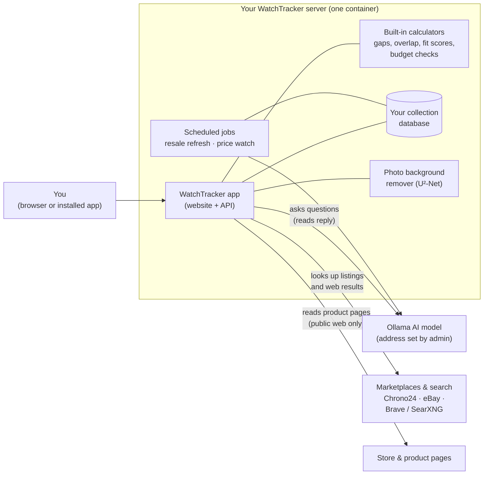
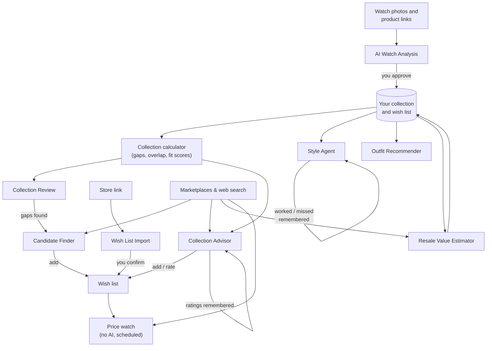
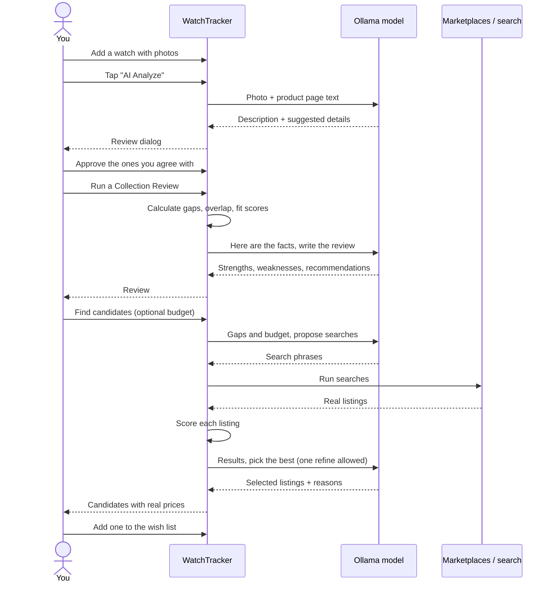
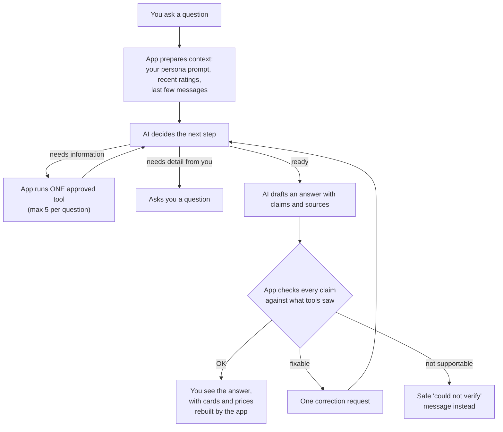

# How the AI Helpers Work

WatchTracker includes several AI helpers ("agents") that look at your collection and help with everyday collector questions: *What is this watch? What should I wear it with? What am I missing? What is it worth?*

This page explains, in plain language, what each helper does, where it runs, what it can look at, and how they fit together. For the operator-level details of the Collection Advisor, see [`collection-advisor.md`](collection-advisor.md).

## The short version

- **You stay in control.** The AI only suggests. Nothing is saved to your collection until you review and approve it.
- **The AI runs on your own server.** All helpers talk to an [Ollama](https://ollama.com) model that your admin configures. Your collection is not sent to a third-party AI service.
- **The AI never does the math.** Counts, gaps, fit scores, prices and dates are calculated by the app itself. The AI reads those facts and explains them.
- **Everything is private to you.** Every helper only sees your own watches and wish list.
- **Prices come from real listings.** The AI cannot invent a price or a listing. Anything shown as a listing or a price came back from a real marketplace or web search.

## Meet the helpers

| Helper | Where you find it | What it does |
| --- | --- | --- |
| **AI Watch Analysis** | Watch page → overflow menu → *AI Analyze* | Looks at your watch photo (and its product pages) and suggests a description and missing details such as dial colour or case size. |
| **Wish List Import** | *Add to Wish List* → paste a link | Reads a store page and pre-fills brand, model, price and image. |
| **Style Agent** | Watch page → *Style Agent* | Chats with you and recommends an outfit to wear with that watch. Remembers what worked. |
| **Outfit Recommender** | *Recommend* page | You describe an outfit or occasion; it picks two watches from your collection and explains why. |
| **Collection Review** | *Review* page | Reviews your collection and wish list together: strengths, weaknesses, gaps and what to buy next. |
| **Candidate Finder** | *Review* page → find candidates | Turns the review's gaps into real, currently listed watches you could buy. |
| **Collection Advisor** | *Advisor* page | A free-form chat that can research brands, search listings, compare prices and check a budget. |
| **Resale Value Estimator** | Watch page → resale value; runs automatically | Estimates what a watch might sell for, from live listings and web search. |

Two other features are often thought of as AI but are simpler:

- **Background removal** (cleaning up a watch photo) uses a small image model (U²-Net) built into the app. It does not use Ollama.
- **Wish list price watch** scans marketplaces for prices on a schedule using plain rules, not an AI model.

## Where everything runs

In words:

- The **app and its database** live in your WatchTracker container.
- The **AI model** is a separate Ollama service. An admin sets its address and model name under **Admin → Settings → Ollama Configuration**. It can run on the same machine or elsewhere on your network.
- **Marketplace and web search** are optional. Without them the helpers still work on your own collection; they just cannot look up live prices or listings.
- **Scheduled jobs** run inside the app on a timer (a resale check every 6 hours and a price-watch check every hour), so nothing extra needs to be installed.

## What each helper does

### AI Watch Analysis

**Purpose:** Fill in details you have not recorded yet.

1. You tap *AI Analyze* on a watch.
2. The app sends the cover photo to the model, plus the text of the watch's **Product/Reference** and **Acquisition Source** pages if you saved those links.
3. The model returns a short description (under 70 words) and suggested values for blank fields, each with a confidence and a reason.
4. You see a review dialog. Low-confidence guesses start unticked. Only what you tick is saved.

**Tools it uses:** the watch photo, a safe page reader for your saved links.
**Guardrails:** only blank fields are suggested; only fields on an approved list can be filled (never serial number, prices, storage or notes); every value is re-checked before saving.

### Wish List Import

**Purpose:** Save typing when adding a watch you want.

1. You paste a store link.
2. The app reads the page and pulls out what is clearly stated (brand, model, price, image) using the page's own structured data first.
3. The AI fills in whatever the page did not state clearly.
4. The result opens in the normal form for you to edit. Nothing is saved until you confirm.

**Guardrails:** only USD prices are imported; out-of-range prices are dropped with a warning.

### Style Agent

**Purpose:** Answer "what do I wear this watch with?"

- It **looks at the watch photo** every turn, so an orange dial is styled as orange even if you never typed it in.
- It **asks before it advises.** It wants to know the occasion and the weather first.
- It **remembers.** Every outfit it suggests is saved against that watch, and you can mark each one **Worked** or **Missed**. Future advice repeats what worked and avoids what missed. Rated outfits from your other watches help it learn your taste.
- **New chat** clears the conversation but keeps the memory; **Forget** removes a single memory.

**Tools it uses:** the watch photo, the watch's details, its saved outfit memories. It does not search the web.

### Outfit Recommender

**Purpose:** "I'm wearing X tonight. Which watch?"

You describe the occasion, outfit, colours, weather and preferences. The app gives the model a list of your active watches (with dial colour, band, size, water resistance and how often you wear them) and the model picks a **primary** and a **backup** watch with styling tips. The app checks that both picks are real, distinct watches from your collection before showing them.

### Collection Review

**Purpose:** An honest second opinion on the collection as a whole.

This is a two-step process (the app does the counting, the AI does the explaining):

1. **The app calculates the facts:** counts, coverage by type/size/colour, overlapping watches, gaps, data quality, and how well each wish list item fits.
2. **The AI writes the review** from those facts: strengths, weaknesses and recommendations, each pointing to the specific watches it is about.

The review is saved and flagged as **out of date** when your collection changes.

### Candidate Finder

**Purpose:** Turn "you're missing a dress watch" into actual watches for sale.

1. The AI proposes up to five search phrases based on the review's gaps (and your budget, if you give one).
2. The app runs those searches on the marketplaces and returns real listings.
3. The AI may refine its search **once**, then picks up to six listings and says why each one fits.
4. The app scores every listing itself, so the AI never supplies a price or score.

Listings older than a few days are hidden so you are not shown watches that have probably sold. You can add a candidate straight to your wish list.

### Collection Advisor

**Purpose:** Ask anything about your collection or the market.

The advisor is the most capable helper. It decides which **tools** it needs, uses them, reads the results and answers (or asks you a clarifying question).

| Tool | What it gives the advisor |
| --- | --- |
| `collection_profile` | Coverage, gaps, overlap, data quality, wear and wish list overlap, calculated by the app |
| `collection_watches` | Your active watches and their recorded details |
| `wishlist_context` | Your wish list and priorities |
| `marketplace_search` | Current fixed-price listings (optionally under a budget) |
| `resale_comparables` | Low / middle / high **asking** prices for a model |
| `web_research` | Current web results with source links |
| `score_listing` | How well a listing fits your collection and budget |

Limits: at most **5 tool calls**, **90 seconds** per question, and a fixed size limit on what it reads.

**Trust rules:** every statement about the outside world must cite a link the tools actually saw. If a search fails, the advisor says so instead of guessing. Prices and listing cards are rebuilt by the app from real results, not copied from the AI's text.

You can add recommendations to your wish list and mark them helpful, irrelevant, already owned, or not interested. The ten most recent ratings shape later answers.

### Resale Value Estimator

**Purpose:** Keep a rough current value for each watch.

Two sources are averaged when both are available:

1. **eBay:** the average of current fixed-price USD listings for the brand and model.
2. **Web search + AI:** the app searches for used-price results and the AI reads the snippets to estimate a value.

The estimate and the reasoning are saved to the watch's history. Estimates refresh automatically at most once a week per watch (an app check runs every 6 hours), or on demand from the watch page or the admin page. These are asking-price observations, **not appraisals**.

## How the helpers work together

The helpers share the same building blocks, so what one learns can help another.

A typical journey looks like this:

How the Collection Advisor thinks through one question:

## Safety and privacy

- **Only your data.** Every lookup is limited to your own account.
- **Web content is treated as text, not orders.** Store pages, search snippets and even your own notes are labelled as untrusted, so a page that says "ignore your instructions" has no effect.
- **Safe page fetching.** Product links are only followed if they are public web addresses, so the server cannot be tricked into reading your private network.
- **Limits.** Each helper has a time limit and a size limit, and the busy ones are rate limited.
- **You approve changes.** Analysis suggestions, wish list imports and wish list additions all need your confirmation.
- **Logs stay private by default.** Normal logging does not record prompts, replies or collection contents. Setting the log level to `Debug` or `Trace` does, so use it only while troubleshooting.

## Settings for admins

Under **Admin → Settings**:

| Setting | Used by |
| --- | --- |
| Ollama URL and model | All AI helpers except background removal and price watch |
| Prompts (analysis, resale valuation, style agent, outfit recommendation, collection advisor) | The persona of each helper. Tool, grounding and safety rules stay fixed in code, so editing a prompt cannot break them. |
| Web search provider (Brave or SearXNG) and credentials | Advisor, resale estimate |
| Marketplace vendor / eBay credentials | Advisor, candidate finder, resale estimate, price watch |
| Resale refresh interval | Resale Value Estimator |
| Price monitoring interval | Price watch |

**Tip:** Use a model that can read images (a "vision" model) for the best results from AI Analyze and the Style Agent. If the model cannot accept images, the Style Agent automatically retries without the photo.
